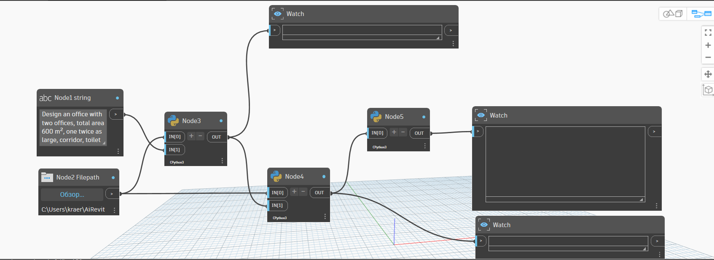
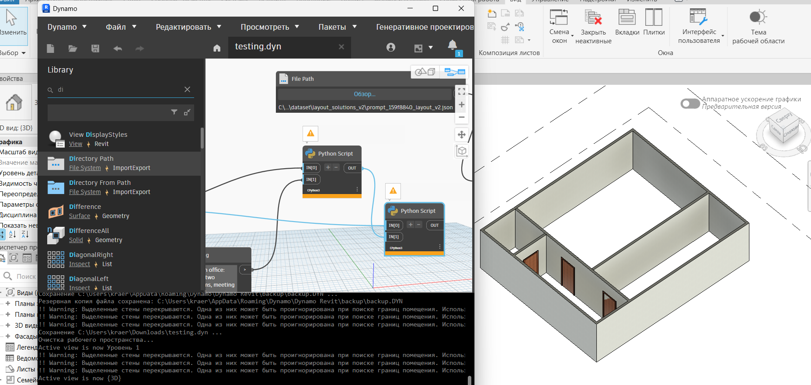
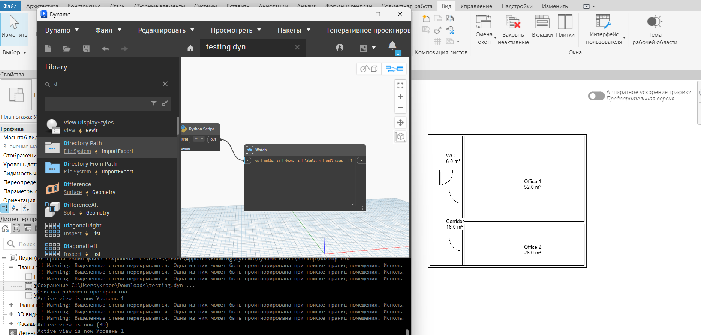

<p align="center">
  
  
  
  
  
  
</p>

# 🏗️ AiRevit: Text-to-BIM — Zero Hallucination Generative Engine

> **Most "AI in BIM" tools are just LLM wrappers with unpredictable outputs.**  
> AiRevit takes a fundamentally different approach.

**AiRevit** is a fully deterministic, data-driven pipeline that converts natural language architectural briefs into optimized floor layouts and deploys them directly as 3D BIM elements in Autodesk Revit — **without a single LLM call**, without unpredictable outputs, and with zero hallucinations.

---

## 🧠 The Core Philosophy: Rules over Hallucinations

The generative AI hype has a serious problem in AEC: **LLMs do not understand architectural constraints.**  
They will happily generate a toilet inside a load-bearing structural core, or propose a 3m² office as "suitable for 10 people."

AiRevit instead uses a **hard-coded semantic vocabulary parser + graph-based layout solver**, preparing for a future **Graph Neural Network (GNN)** engine trained on a growing, structured dataset. 

This project is designed to scale **without modifying core nodes** (Node 3, 4, 5). All architectural knowledge lives in data files, not in code.

---

## ⚙️ How The Pipeline Works

When a user sends a prompt like:
> *Design an office with two offices, total area 600 m², one twice as large, corridor, toilet*

The pipeline does the following:

1. **Node 3** reads `vocabulary.json` and recognizes the space type.
2. **Node 4** reads `space_types.json` and knows how to place and size it.
3. **Node 5** builds it in Revit.

No code changes needed — only data files!

### Nodes Architecture in Dynamo


### Expected Results



---

## ⚡ Quick Start: Running entirely in Dynamo

This pipeline is designed to be run from start to finish directly inside **Dynamo** (Revit 2023 / 2024+).

### The Node Setup (Building the Graph)

**Node 1 — User Prompt**
* Use a `String` node. Enter your prompt here: *"Design an office with two offices, total area 600 m², one twice as large, corridor, toilet"*

**Node 2 — Directory Path**
* Use a `Directory Path` node pointing to the directory where you cloned `AiRevit`.

**Node 3 — Python Script (Prompt to Graph)**
* Use a `Python Script` node. Connect Node 2 to `IN[0]`, Node 1 to `IN[1]`.
* Output connects to a `Watch` node, then to Node 4.

**Node 4 — Python Script (Graph to Layout)**
* Use a `Python Script` node. Connect Node 2 to `IN[0]`, Node 3 to `IN[1]`.
* Output connects to a `Watch` node, then to Node 5.

**Node 5 — Python Script (Create Revit Elements)**
* Use a `Python Script` node. Connect Node 4 to `IN[0]`.

*(For the exact Python code for these nodes, check the `dynamo_pipeline.md` or the corresponding python scripts in this repository).*

---

## 🛠 Adding a New Space Type

### Step 1. Add synonyms to `vocabulary.json`
Find the `space_types` section and add your type:
```json
"wardrobe": [
  "wardrobe",
  "cloakroom",
  "coat room",
  "locker room",
  "changing room",
  "dressing room"
]
```

### Step 2. Add rules to `space_types.json`
```json
"wardrobe": {
  "group": "service",
  "preferred_near": ["entrance", "corridor"],
  "min_area_m2": 4.0,
  "max_area_m2": 20.0,
  "preferred_area_ratio": 0.08,
  "min_small_dim_mm": 1800,
  "min_large_dim_mm": 2400,
  "requires_daylight": false,
  "is_wet_zone": false,
  "position_priority": 1
}
```

### Step 3. Add your dataset files
Place your annotated `program_graph.json` files into:
`dataset/program_graphs/`

**That's it. No code changes required.**

---

## 📚 Space Groups

Each space type belongs to a group. The group defines where the space is placed in the layout.

| Group | Description | Examples |
|-------|-------------|----------|
| **circulation** | Connects other spaces | corridor, hallway |
| **primary** | Main functional spaces | office, bedroom, meeting room |
| **service** | Support spaces | wc, wardrobe, storage |
| **wet** | Spaces with water supply | wc, kitchen |
| **public** | Guest-facing spaces | reception, dining, lobby |

---

## 📖 Field reference for `space_types.json`

| Field | Type | Description |
|-------|------|-------------|
| `group` | string | Layout group (see table above) |
| `preferred_near` | list | Space kinds this should be placed near |
| `min_area_m2` | number | Minimum allowed area |
| `max_area_m2` | number or null | Maximum allowed area |
| `preferred_area_ratio` | number or null | Fraction of total area (e.g. 0.08 = 8%) |
| `min_small_dim_mm` | number | Minimum short dimension in mm |
| `min_large_dim_mm` | number | Minimum long dimension in mm |
| `requires_daylight` | bool | Must touch exterior wall |
| `is_wet_zone` | bool | Has water supply and drainage |
| `position_priority` | number | Order within service strip (1 = closest to entrance) |

### If your space type is not in `space_types.json`
The generator will use safe defaults:
```json
{
  "group": "service",
  "min_small_dim_mm": 2000,
  "min_large_dim_mm": 2000,
  "requires_daylight": false,
  "is_wet_zone": false
}
```
The layout will still generate without errors. We recommend adding proper rules for best results.

---

## 🧬 Forking this repository

If you want to build your own domain on top of this project:

1. **Fork the repository**
2. **Add your space types** to `vocabulary.json` and `space_types.json`
3. **Add your dataset** to `dataset/program_graphs/`
4. **Run the pipeline** — no core code changes needed!

**Examples of possible forks:**
* **Restaurant fork** — dining, kitchen, bar, storage, staff room
* **Apartment fork** — bedroom, living room, kitchen, bathroom, balcony
* **Clinic fork** — waiting room, examination room, office, wc, reception

---

## 🤝 Contributing Back

If you have annotated dataset files and want to contribute:

1. Make sure your files pass validation:
```bash
python validators/validate_program_graph.py
```
2. Open a Pull Request to the `dataset/program_graphs/` folder 

Include in your PR description:
* building type
* number of files
* space types used
* source (synthetic / real anonymized)

---

## 📄 License
MIT — free to use, modify, and distribute.
